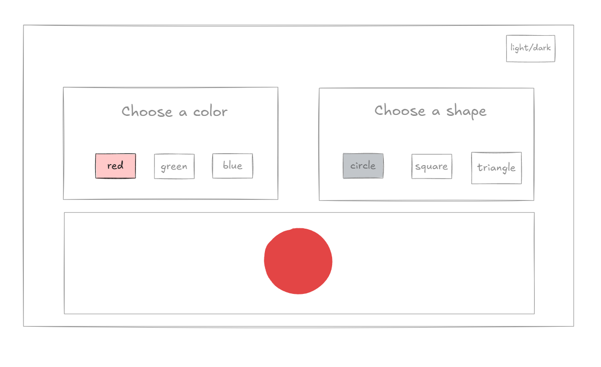
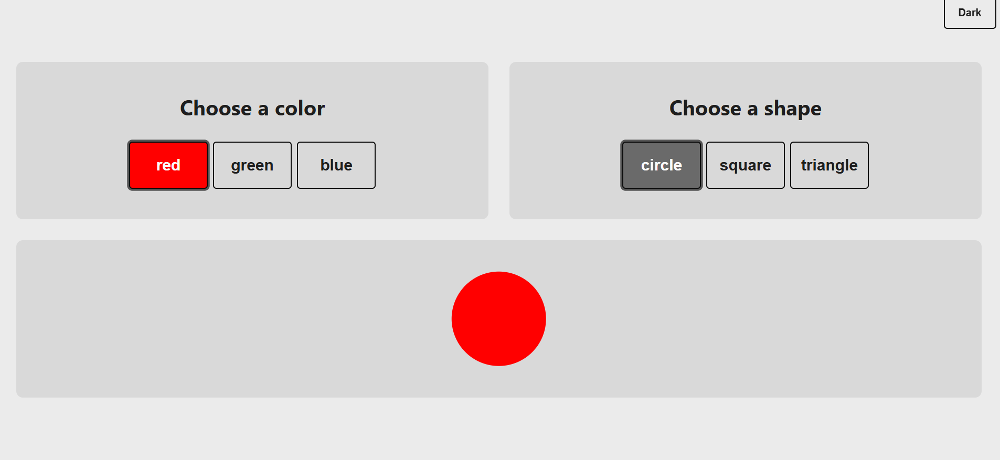
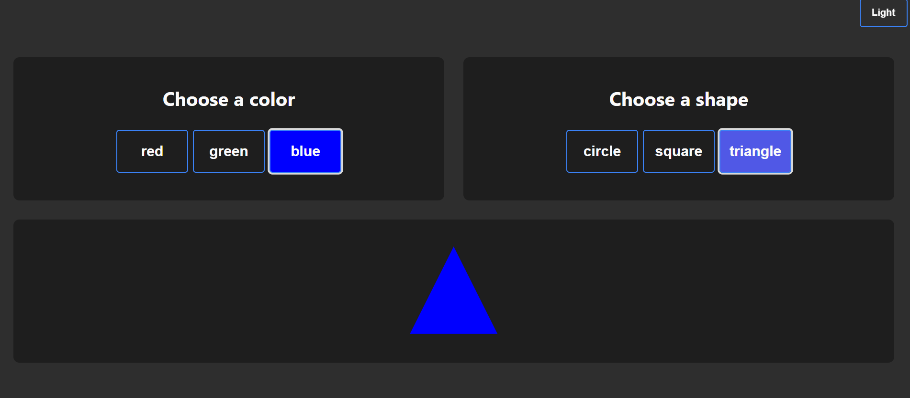

# Redux Shape Picker 🟦🔺🟢

A simple visual playground built with **React**, **Redux Toolkit**, and **Storybook**. Users can choose a shape and a color, and see it instantly rendered on screen. The project demonstrates Redux usage with modern patterns, component-based design, and styled customization.

## Live Demo
> [try it here](https://redux-shape-picker.netlify.app/)

> [storybook](https://adimalka14.github.io/redux-shape-picker/)

## 🔧 Tech Stack

* React (Vite setup)
* Redux Toolkit (modern Redux with `createSlice`, `useSelector`, `useDispatch`)
* SCSS (modular styling with CSS variables)
* Storybook for UI component development
* Prettier for consistent code formatting

---

## 🎨 Features

* **Live shape and color selection**
* **Centralized state** using Redux Toolkit
* **Component isolation and testing** with Storybook
* **Dark/Light Theme toggle**
* **Prettier** integrated for clean codebase

---

## Installation & Local Setup (npm)

### Prerequisites

* **Node.js ≥ 20**
* **npm ≥ 9**

### 1 — Clone

```bash
git clone https://github.com/adimalka14/redux-shape-picker.git
cd redux-shape-picker
npm install
```

### 2 —  Install dependencies

```bash
npm install
```

### 3 — Run development 

```bash
npm run dev 
```
then open http://localhost:5173/

---


## 📚 Redux Overview

Using Redux Toolkit:

### `shapeSlice.js`

```js
import { createSlice } from '@reduxjs/toolkit';

const initialState = {
  value: null,
};

const shapeSlice = createSlice({
  name: 'shape',
  initialState,
  reducers: {
    setShape: (state, action) => {
      state.value = action.payload;
    },
  },
});

export const { setShape } = shapeSlice.actions;
export default shapeSlice.reducer;
```

### `useShapeSelector.js`

```js
import { useDispatch, useSelector } from 'react-redux';
import { setShape } from './shapeSlice';

export const useShapeSelector = () => {
  const dispatch = useDispatch();
  const selected = useSelector((state) => state.shape.value);

  const options = ['circle', 'square', 'triangle'];

  return {
    options,
    selected,
    onSelect: (shape) => dispatch(setShape(shape)),
  };
};
```


## 📸 Screenshots / Demo

### Plan


### Result

#### Light theme


#### Dark theme



---